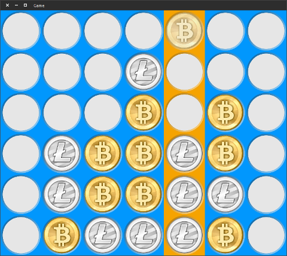

# ConnectFour
--------------
Connect four. No more. Just four. Not one, or two, but three- I mean four.

## Dependencies
	SDL2
	SDL2_image
	SDL2_ttf

You can install these libraries on Ubuntu by typing:
> sudo apt-get install libsdl2-2.0-0 libsdl2-dev libsdl2-image-2.0-0 libsdl2-image-dev libsdl2-ttf-2.0-0 libsdl2-ttf-dev 

